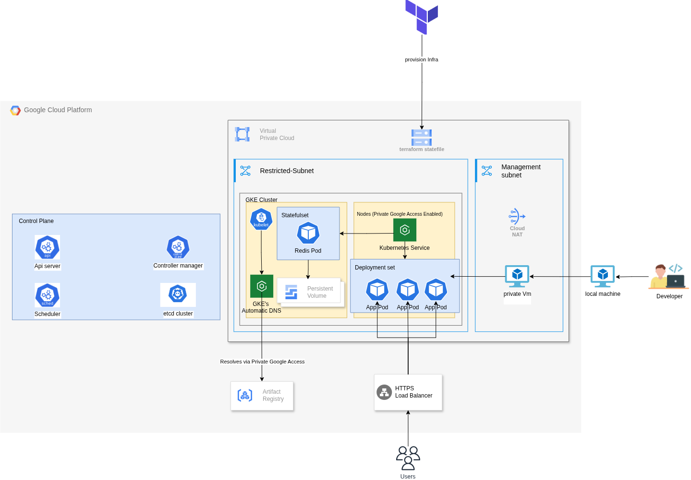

# GCP Infrastructure Deployment with Private GKE and Public Load Balancer

## 📌 Project Overview

This project provisions a secure and production-ready infrastructure on **Google Cloud Platform (GCP)** using **Terraform**. It includes a **private GKE cluster**, **private VM**, **custom VPC with two subnets**, **public HTTP load balancer**, and secure image deployments from **Artifact Registry**.

All infrastructure is defined as code and adheres to the following requirements:

---

## 📚 Source Code Credits

> ⚠️ The Python Flask application code was **cloned** from [Ahmed Zaki's](https://github.com/ahmedzak7) [DevOps Challenge](<[URL](https://github.com/ahmedzak7/GCP-2025/tree/main)>).  
> This project focuses on implementing the **infrastructure and deployment** using **Terraform**, **Docker**, and **Kubernetes on GKE**.

---

## 🗂️ Infrastructure Components

### 1. **VPC Network**

- A single **custom VPC** named `salma-vpc`.

### 2. **Subnets**

- **Management Subnet (`salma-management-subnet`)**

  - Private VM (bastion/jumpbox) deployed here.
  - Has access to the internet via a **Cloud NAT** gateway.
  - Used to deploy workloads to the private GKE cluster using `kubectl`.

- **Restricted Subnet (`salma-restricted-subnet`)**
  - Hosts the **private GKE cluster** with private nodes and control plane.
  - Has **no internet access**.
  - Secured with **authorized networks** (bonus).
  - Custom service account attached to GKE nodes.

---

## 🧱 GKE Cluster

- **Private GKE cluster**: No public control plane.
- Nodes and control plane only accessible from **management subnet**.
- Uses **custom node service account** with minimal IAM roles.
- Workloads (e.g., Redis) are deployed as a **StatefulSet**.
- All container images are pulled from **Google Artifact Registry (GAR)**.

---

## 🔐 Security Design

- **Restricted Subnet**: Fully isolated from internet.
- **Management Subnet**: Uses Cloud NAT for outbound access.
- Only `kubectl` from VM in **management subnet** can interact with the cluster.
- GKE nodes access only private Artifact Registry.
- **Authorized networks** restrict control plane access.
- **Firewall rules** restrict access based on tags and IP ranges.

---

## 🌐 Public Exposure

- A **Google HTTP Load Balancer** is provisioned.
- Exposes the deployed GKE application (e.g., frontend service) to the public internet.
- Targets GKE services with an internal backend and a public frontend.

---

## Project Infrastructure

## 

## 🚀 Deployment Flow

1. **Terraform Infrastructure Deployment**

   - Run `terraform init && terraform apply` to create:
     - VPC, subnets
     - NAT gateway
     - GKE cluster (private)
     - Private VM
     - Artifact Registry
     - Load balancer

   ```
   cd terraform
   terraform init
   terraform applt -auto-approve
   ```

2. **Dockerize Application**

   In the **private instance** in managment subnet

- SSH into the **private VM** from Cloud Console.

- Install Required Tools (on the VM)
  ```
  sudo apt update
  sudo apt install -y docker.io
  sudo apt install -y kubectl
  sudo apt install -y google-cloud-sdk-gke-gcloud-auth-plugin
  ```
- Clone the repo:
  ```
  git clone https://github.com/sallmayasser/Python-GKE-Application-with-Terraform-and-Kubernetes.git
  cd Python-GKE-Application-with-Terraform-and-Kubernetes
  ```
- Pull redis image from dockerhub and push it in artifact registry

  ```
  docker pull redis
  docker push <region>-docker.pkg.dev/<project-id>/<repo-name>/redis:latest
  ```

- Build Docker images:
  ```
  bash
  gcloud auth configure-docker
  docker build -t <region>-docker.pkg.dev/<project-id>/<repo-name>/app:tag .
  docker push <region>-docker.pkg.dev/<project-id>/<repo-name>/python-app:latest
  ```

3. **Deploy to GKE via Management VM**

   - Authenticate with GKE:
     ```bash
     gcloud container clusters get-credentials <cluster-name> --zone <zone> --project <project-id>
     ```
   - Apply Kubernetes manifests (Redis, app, service, etc.):
     ```bash
     kubectl apply -f k8s/
     ```
   - Get the ingress External IP

     ```
     kubectl get ingress
     ```

   - Access the app via http://<EXTERNAL_IP>

   

---

## 🗃️ Tools & Services Used

| Component         | Technology                |
| ----------------- | ------------------------- |
| Infrastructure    | Terraform                 |
| Containerization  | Docker                    |
| Container Hosting | Google Artifact Registry  |
| Kubernetes Engine | GKE (Private)             |
| Load Balancing    | Google HTTP Load Balancer |
| Networking        | VPC, Subnets, NAT         |
| Deployment        | kubectl from VM           |

---

## 📂 Project Structure

```
├── Code
│   ├── dockerfile
│   ├── hello.py
│   ├── LICENSE
│   ├── README.md
│   ├── requirements.txt
│   ├── static
│   │   ├── css
│   │   │   └── style.css
│   │   └── favicon.ico
│   ├── templates
│   │   └── index.html
│   └── tests
│       └── test.py
├── k8s
│   ├── app-deployment.yaml
│   ├── ingress.yaml
│   └── redis.yaml
├── README.md
└── terraform
    ├── backend.tf
    ├── firewalls.tf
    ├── gcr.tf
    ├── gke.tf
    ├── instance.tf
    ├── provider.tf
    ├── variables.tf
    └── vpc.tf
```
## 🧑‍💻 Author

salma yasser <br>
DevOps Engineer <br>
📧 [sallmayasser512@gmail.com](mailto:sallmayasser512@gmail.com) <br>
🔗 [LinkedIn](https://www.linkedin.com/in/sallma-yasser)